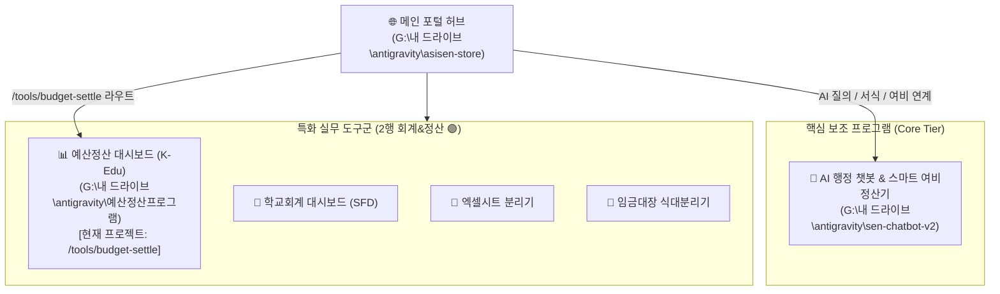

# K-Edu 예산정산 대시보드 개발 가이드 & 프로젝트 명세 (GEMINI.md)

본 문서는 **예산정산 대시보드(K-Edu Budget Dashboard)**의 아키텍처, 상위 생태계(AI-SEN STORE) 연계 구조, 기능 명세 및 개발/배포 가이드를 정리한 프로젝트 기술 문서입니다.

---

## 🏛️ 1. 프로젝트 개요 & 상위 생태계 연계

- **프로젝트명**: K-Edu 예산정산 대시보드 (`k-lunch-budget-dashboard`)
- **로컬 경로**: `G:\내 드라이브\antigravity\예산정산프로그램\`
- **GitHub 저장소**: `https://github.com/bamnamoo-dev/budget-dashboard.git`
- **웹 서비스 URL**: `https://bamnamoo-dev.github.io/budget-dashboard/`
- **단독 실행 파일**: `예산정산대시보드.exe` (PyInstaller 패키징)

### 🔗 AI-SEN 생태계 내 위계 및 연계 구조



- **메인 포털**: **[AI-SEN STORE](file:///g:/%EB%82%B4%20%EB%93%9C%EB%9D%BC%EC%9D%B4%EB%B8%8C/antigravity/asisen-store/GEMINI.md)** (`\asisen-store\`)
  - 전국의 교육행정 실무 도구, 102권 서고, RAG 챗봇, 실무 게시판을 총괄하는 관제 허브
- **주요 보조 프로그램**: **[AI 행정 챗봇 v2](file:///g:/%EB%82%B4%20%EB%93%9C%EB%9D%BC%EC%9D%B4%EB%B8%8C/antigravity/sen-chatbot-v2/SKILL.md)** (`\sen-chatbot-v2\`)
  - 3-Tier FastMCP RAG AI 질의응답, 스마트 여비정산기 v4.9.2, 행정·민원 서식 68종을 지원하는 핵심 AI 엔진
- **본 프로젝트의 역할**: **K-Edu 예산정산 대시보드** (`\예산정산프로그램\`)
  - 메인 포털 **2행(회계 & 정산 🟢 / `/tools/budget-settle`)**의 핵심 연계 실무 도구.
  - 학교회계 목적사업비, 수익자부담경비(학교급식비, 현장체험학습비, 방과후학교 등)의 **세입 산출내역 대비 세출 집행내역 실시간 1:1 연동 정산 및 불용·잔액 자동 분석**.

---

## 🛠️ 2. 기술 스택 및 아키텍처

| 계층 / 도구 | 사용 기술 | 설명 |
| :--- | :--- | :--- |
| **Frontend UI** | HTML5, CSS3 (Modern Glassmorphism) | Dark/Light 테마 시스템, 반응형 사이드바 레이아웃, 인쇄(Print) 최적화 스타일 |
| **Typography & Icons** | Outfit, Noto Sans KR, Font Awesome 6 | 현대적인 타이포그래피 및 가독성 높은 금융/행정 아이콘 셋 |
| **Logic & State** | Vanilla Modern JavaScript (ES6+) | 모듈화된 이벤트 핸들링, 다중 사업 프로필 상태 관리, 실시간 통계 계산 |
| **Data Visualization** | Chart.js 4.x | 월별 집행 추이(Bar Chart), 비목별 지출 비중(Doughnut Chart) |
| **Excel Processing** | SheetJS (`xlsx.full.min.js`) | K-에듀파인 지출내역/세입예산 엑셀 파일 클라이언트 0초 메모리 파싱 & 템플릿 다운로드 |
| **Build Tool** | Vite 5.x | HMR 개발 환경 및 경량화 정적 배포 번들링 (`dist/`) |
| **Desktop Wrapper** | Python 3 (`run_app.py`), PyInstaller | 로컬 경량 HTTP 서버 + Heartbeat 기반 자동 종료 + `dashboard_state.json` 파일 영속화 |
| **CI/CD & Hosting** | GitHub Actions & GitHub Pages | `main` 브랜치 Push 시 `dist/` 자동 빌드 및 배포 |

---

## 📂 3. 디렉터리 및 주요 파일 구조

```
예산정산프로그램/
├── .github/
│   └── workflows/
│       └── deploy.yml          # GitHub Pages 자동 배포 CI/CD 파이프라인
├── dist/                       # Vite 프로덕션 빌드 결과물 (정적 호스팅 및 Python 번들용)
├── public/                     # 정적 에셋 (파비콘 등)
├── src/
│   ├── main.js                 # 핵심 애플리케이션 로직 (정산 계산, 프로필 관리, 차트, 엑셀 파서)
│   └── style.css               # 디자인 시스템 (CSS 변수, Glassmorphism, 다크/라이트 테마, 인쇄 CSS)
├── dashboard_state.json        # 로컬 실행 시 영속 저장되는 사업 프로필 및 정산 데이터
├── data.json                   # 기본 시연용 샘플 예산/지출 데이터
├── index.html                  # 메인 SPA HTML 마크업 (대시보드/세입/세출/월별/지출실적 탭)
├── package.json                # npm 스크립트 및 Vite 의존성
├── run_app.py                  # PyInstaller용 로컬 서버 및 자동 브라우저 실행 래퍼
├── vite.config.js              # Vite 설정 파일 (기본 베이스 경로: './')
├── 급식비정산대시보드.spec      # PyInstaller 빌드 명세 파일
├── 예산정산대시보드.exe         # 단독 실행 가능한 Windows 데스크톱 실행 파일
└── GEMINI.md                   # 프로젝트 개발 가이드 및 명세 (본 문서)
```

---

## 💡 4. 핵심 기능 명세

### 1) 📊 정산 대시보드 (`#tab-dashboard`)
- **KPI 지표 요약**: 총 예산액, 실제 세입액, 세출 집행액, 최종 정산잔액, 집행률 실시간 카드 표시
- **정산 총괄표 엑셀(`.xlsx`) 다운로드**: 세입-세출-잔액-집행률 총괄표를 SheetJS 기반 서식 엑셀 파일로 즉시 다운로드 (`exportSettlementToExcel()`)
- **인터랙티브 차트**:
  - **월별 지출 추이**: 3월 ~ 익년 2월(학년도 기준) 지출 추이 시각화
  - **비목/원가별 비중**: 인건비, 식품비, 운영비 등 항목별 도넛 차트
- **빠른 불용 잔액 경고**: 과다 집행 또는 세입 결손 위험 발생 시 시각적 알림

### 2) 💵 세입 산출내역 관리 (`#tab-revenue`)
- 세입 예산액 vs 실제 수납액 비교 및 수납율 자동 산출
- 세입 산출내역 추가/수정/삭제
- 세출 항목과의 재원 매핑 상태 시각화

### 3) 🧾 세출 산출내역 관리 & 드릴다운 (`#tab-expenditure`)
- 세출 예산액 vs 집행 실적 1:1 비교 및 잔액/집행률 자동 산출
- **산출내역별 지출 상세 드릴다운 (Drill-down)**: 산출내역명 클릭 시 해당 비목에 매칭된 지출 품의/결의 내역을 팝업 모달(`#transaction-drilldown-modal`)로 즉시 필터링하여 조회

### 4) 📅 월별 및 산출내역별 조회 (`#tab-monthly`)
- 학년도(3월~익년 2월) 월별 지출 현황 필터링
- 산출내역별 월별 집행 매트릭스 그리드 제공

### 5) 📋 상세 지출실적 원장 (`#tab-transactions`)
- K-에듀파인 지출품의/결의 수준의 세부 거래 내역 테이블
- 거래처, 적요, 금액, 지출일자, 산출내역별 실시간 검색 및 필터링
- **실시간 필터 합계 금액 표기**: 검색/필터 조건에 부합하는 거래 건수 및 **총 지출 합계 금액(`transactions-total-amount`)** 실시간 계산 표시

### 6) 📁 다중 사업 프로필 & 전체 JSON 백업/복원
- 단일 프로그램 내에서 여러 사업(예: `2026학년도 학교급식비`, `방과후학교 운영`, `현장체험학습`, `목적사업비`)을 독립적으로 생성/전환/삭제
- **전체 JSON 백업/복원**: 등록된 모든 프로필과 장부 데이터를 단일 `.json` 파일로 일괄 내보내기 및 1초 복구 지원

### 7) 📥 엑셀 업로드 및 지능형 자동 배치
- **에듀파인 엑셀 3종 일괄 임포트**: 세입 산출내역, 세출 산출내역, 지출실적조회(원인행위) 엑셀 파싱
- **헤더 지능형 자동 감지**: 파일 순서가 바뀌어도 컬럼명을 분석하여 알맞은 영역에 자동 배치

### 8) 📅 학년도 및 기준일자 100% 동적 연동
- 지출 일자(3월 1일 ~ 익년 2월 말)를 기준으로 `XXXX학년도`를 자동 판별하여 사이드바, 헤더 타이틀, 브라우저 탭 및 다운로드 파일명에 동적 반영

### 9) 🖨️ 결재용 A4 가로(Landscape) 2장 분할 인쇄 및 PDF 내보내기
- **A4 가로 자동 최적화 (`@page { size: landscape; }`)**: 인쇄 시 가로 방향으로 자동 전환되어 표가 겹치지 않고 넓고 시원하게 출력
- **정확한 2페이지 분할 레이아웃 (`break-before: page`)**:
  - **제 1장 (결재용 정산 총괄표)**: 공문서 상단 헤더 + 1행 3열 KPI 카드 + 예산세입세출 연동 정산표가 1장에 꽉 차게 들어감
  - **제 2장 (시각화 분석 보고서)**: 월별 집행 추이 막대 차트 + 주요 재원 집행 상태 요약이 2페이지에 2열 그리드로 큼직하게 배치
- **잉크 절약형 고대비 흑백 공문서 서식**: 다크 모드 상태에서도 출력물은 자동으로 순백색 바탕 및 선명한 실선 표 서식으로 출력

### 10) 📖 인터랙티브 사용자 매뉴얼 & 가이드 내장 (`#user-manual-modal`)
- 상단 헤더의 **[사용 설명서]** 버튼을 통해 언제든 열어볼 수 있는 5-탭 글래스모피즘 사용자 매뉴얼
  1. **🚀 3단계 빠른 시작 (Quick Start)**: 프로필 선택 ➡️ 엑셀 3종 다운 ➡️ 드래그앤드롭 적용
  2. **📥 K-에듀파인 엑셀 다운로드 상세 가이드**: 세입/세출/지출실적(원인행위) 메뉴 경로 및 팁
  3. **📊 정산 지표 & 잔액 공식 이해**: 예산상 잔액 vs 실제 정산 잔액(반납·이월 기준) 계산식
  4. **🔗 재원 매핑 & 다중 사업 프로필**: 목적사업비 1:1/1:N 매핑 및 자체재원 자동 분류
  5. **🖨️ 결재용 A4 인쇄 & 데이터 보안**: 브라우저 인쇄 옵션 및 100% 브라우저 메모리 보안 원칙

---

## 🔒 5. 보안 및 데이터 영속화 아키텍처

```mermaid
flowchart TD
    User([사용자 브라우저 / EXE]) --> UI[SPA 대시보드 UI]
    UI --> Memory[Client-side SheetJS / In-Memory State]
    
    subgraph Storage [데이터 영속화 (Dual Mode)]
        Memory -->|Web 배포 모드| LS[(Browser LocalStorage)]
        Memory -->|EXE 로컬 실행 모드| API["Python Server (/api/save_state)"]
        API --> JSONFile[(dashboard_state.json)]
    end
```

1. **클라이언트 0초 무부하 & 100% 보안**:
   - 모든 엑셀 파싱 및 정산 연산이 사용자 PC(브라우저 메모리) 안에서 수행되어 외부 서버 유출 위험이 없습니다.
2. **이중 영속화 (Dual Persistence)**:
   - **웹 호스팅(GitHub Pages / AI-SEN 포털)**: `localStorage`를 통해 브라우저 캐시에 상태 자동 보존
   - **EXE 실행 모드 (`run_app.py`)**: `/api/save_state` 및 `/api/load_state` REST API를 통해 실행 파일과 동일한 디렉터리의 `dashboard_state.json` 파일에 실시간 영속 저장
3. **Heartbeat 자가 종료 메커니즘**:
   - `run_app.py`는 브라우저가 `/api/heartbeat` 핑을 15초 이상 보내지 않으면(사용자가 탭을 닫으면) 백그라운드 프로세스를 스스로 정리하고 안전하게 종료합니다.

---

## 💻 6. 개발 및 실행 가이드

### 1) 개발 서버 실행 (Vite)
```bash
npm install
npm run dev
# 브라우저에서 http://localhost:3000 접속
```

### 2) 웹 프로덕션 빌드
```bash
npm run build
# dist/ 폴더에 정적 HTML/CSS/JS 생성
```

### 3) Python 로컬 서버 실행 (테스트)
```bash
python run_app.py
```

### 4) Windows EXE 패키징
```bash
# dist 폴더가 최신 빌드 상태여야 함
npm run build

# PyInstaller 패키징
pyinstaller 급식비정산대시보드.spec
# dist/ 폴더 내 생성된 '예산정산대시보드.exe'를 루트 경로로 이동 또는 배포
```

---

## 🎨 7. UI/UX 디자인 가이드라인

1. **테마 시스템**:
   - 다크 모드(기본): 딥 다크 블루/네이비 톤 (`--bg-body: #0b0f19`, `--bg-card: #111827`)
   - 라이트 모드: 클린 화이트/소프트 그레이 톤 (`--bg-body: #f8fafc`, `--bg-card: #ffffff`)
2. **컬러 팔레트**:
   - Primary: `#3b82f6` (Indigo/Blue - 신뢰성, K-Edu 테마)
   - Success / 집행완료: `#10b981` (Emerald Green)
   - Warning / 과다집행 주의: `#f59e0b` (Amber)
   - Danger / 결손 및 초과: `#ef4444` (Rose Red)
3. **인쇄 모드 무결성**:
   - `@media print` 시 배경색 및 그림자를 제거하고 고대비 흑백/단색 테이블 서식으로 전환하여 잉크 절약 및 가독성 확보
